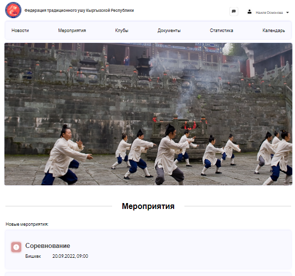

# WushuBoooks

Developed a social project "Wushu Book” from scratch. This is a web application, the purpose of which
is to automate the formation of protocols and arenas by the program based
on applications received from coaches. During the work, an application was developed for 4 roles: for the administrator, secretary, coach and for the chief judge.

 - The division of the application by roles has been developed: admin, secretary, coach, judge.
 - The addition of admin news for all roles has been developed
 - Connected the FullCalendar library, for the possibility of convenient date marking in the calendar.
 - Developed statistics on the achievements of the club and on the personal achievement of each athlete using react-chartjs-2.
 - Developed a live chat using a popular library socket.io

Demo: https://wushubook2-fdp9g.ondigitalocean.app/

__Techonology__

- React
- React-redux
- Reduxjs-toolkit
- React-router
- Axios
- Form-data
- Formik, Yup
- Serve
- Socket.io
- Jwt-decode
- Chart.js
- Fullcalendar
- React-loader-spinner
- Moment
- Material UI
- Styled-components

__Install__

Use the git to clone the project to your local machine.

    git clone https://github.com/BEGIM-bem/WushuBoooks.git

Navigate to the extracted folder

    cd WushuBoooks

Install the dependencies and modules
  
     npm install

__Usage__

    npm run dev
    
